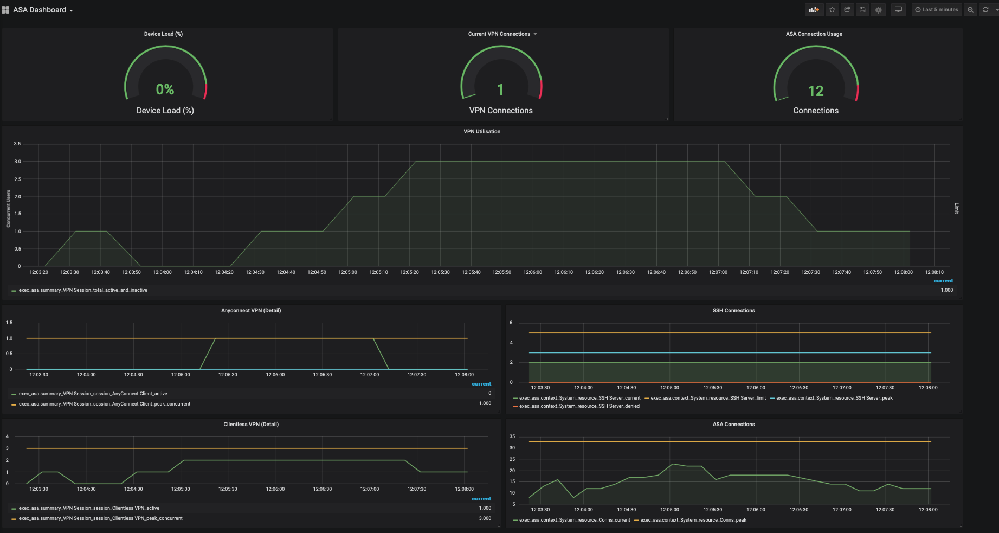
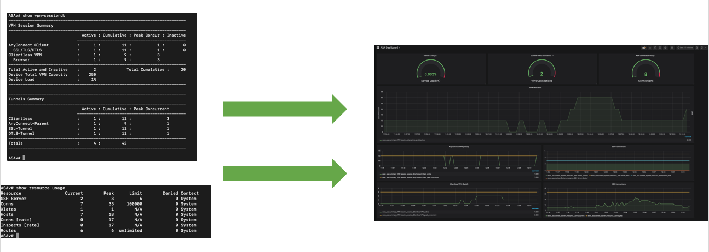
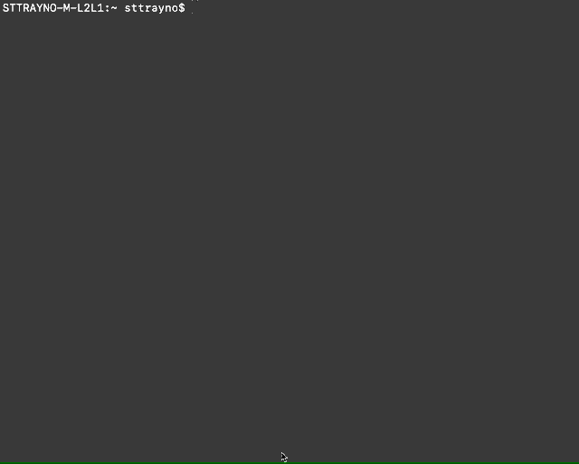
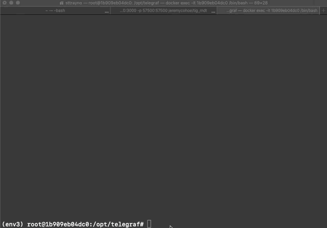

# ASA VPN Health Monitoring

### Example VPN health monitoring dashboard on Grafana for ASA devices [BETA]

With recent events, home working and VPN access have became a priority for many IT organisations, the often forgotten about ASA has became a mission critical part of our IT infrastructure. The challenge however is how do we monitor these devices on an ongoing basis to look for trends in usage, peaks and spot any potential issues with dashboards like below.

If you have any issues with this repo or anything included please raise an issue, this is intended to be a getting started guide so let us know whats missing or what doesn't work and we can make sure to update this document.



In this short lab guide we'll explore the process of collecting data that exists in the command line however is very difficult to collect and monitor on an ongoing basis much as we'd do with Model Driven Telemetry[Link to MDT lab]. In this example we will take CLI output from the firewall using pyATS and parse the output to create a standard JSON output. From this standard JSON output we can use open source data stacks such as TIG (Telegraf, InfluxDB and Grafana) to collect, store and visualise data from ASA devices.



**Note: This lab uses beta parsers from the pyATS project, they have not been throughly tested in all environments so please proceed with caution, much of what we're going to do here will just be connecting to a device via SSH and reading the show command output so risk is limited but please take this into account.**

To run these exercises you will need an instance of an ASA. dCloud has an ASA instance configured for remote that you can reserve and use in this. We'll be using the "Cisco AnyConnect Posture with ASA, ISE, and AMP v1.2" demo. Alternatively you can also use your own ASA if you have one available. This has been tested against ASA Version 9.5(2)203.

## Step 1 - Installing Docker

First off we'll need an environment with the TIG stack installed that we can use, for this guide I'll use a Docker container to automate much of this process. If you already have docker installed you can proceed to Step 2 and start to pull down the containers required. If you do not have docker installed you can consult the docker documentation here

Alternatively you could install the TIG stack on your own system, they are numerous guides on how to do this online. For completeness we'll walk through all the steps here.

## Step 2 - Setup our TIG stack

Thankfully, Jeremy Cohoe has created a fantastic docker container with all the needed components preinstalled. You can pull the container from the Docker hub with the following shell command.

```
docker pull jeremycohoe/tig_mdt
```

Let that pull down the required image from Docker hub then run the following command to start the container.

```
docker run -ti -p 3000:3000 -p 57500:57500 jeremycohoe/tig_mdt
```

As this docker container wasn't fully built for what we're looking to do we need to do some further configuration. To do this, from your shell use the command `docker ps` to display your container id. Take the containerid value which should be 12 digit alphanumeric string and then use the command `docker exec -it <CONTAINER ID HERE> /bin/bash` . Once you do that you should have root prompt for your container.

**Note: I am using the TIG stack container from Jeremy Cohoe as I've mentioned. I am planing on rewriting parts of this lab with a fresh TIG stack install however for ease of use today we will be using Jeremy's container which I've also used in other labs.**



Now we're in use the following commands to install the necessary components and packages, run these one after the other

```bash
apt-get update && apt-get upgrade
apt-get install python3
apt-get install python3-pip && apt-get install python3-venv
apt-get install git
apt-get install ssh
```

Now create some directories we'll use later

```bash
mkdir /opt/telegraf
cd /opt/telegraf
```

And clone this repo into the folder and create a python virtual environment. A Virtual Environment acts as an isolated working copy of Python which allows you to work on a specific project without worry of affecting other projects. It is strongly recommended that you use this as it creates an isolated environment for our exercise which has its own dependencies, regardless of what other packages are installed on the system.

```bash
git clone https://github.com/sttrayno/ASA-Telemetry-Guide.git
python3 -m venv env3
source env3/bin/activate
```

Finally install the Python package requirements with the pip command.

```bash
pip install -U pip
pip install pyats[full]
pip install genie.libs.parser --upgrade --pre
pip install jsonmerge
```

Once you've configured your environment all that is left to do is now test to see if things are working. Try running the following command from the shell which will test using our collection script.

```bash
/opt/telegraf/env3/bin/python /opt/telegraf/ASA-Telemetry-Guide/telegraf/scripts/asascript.py
```



This command should run successfully and return a JSON output from your ASA as above. If it does not, have a look at some of the troubleshooting steps below.

Have a look at the python script asascript.py included in this repo which you can see below. It's actually incredibly simple and is just logging into a ASAv in our testbed, and issuing two commands ('show resource usage' and 'show vpn-sessiondb'). The pyATS libraries are doing the rest and converting this into simple JSON and outputting to the console.

```python
from genie.testbed import load
import json
from jsonmerge import merge

tb = load('/opt/telegraf/ASA-Telemetry-Guide/telegraf/scripts/testbed-asa.yaml')
dev = tb.devices['ASAv']
dev.connect(log_stdout=False)
dev.connect()


p1 = dev.parse('show vpn-sessiondb')
p2 = dev.parse('show resource usage')

p3 = merge(p1,p2)

print(json.dumps(p3))
```

We will now use telegraf for in the next stage to get this into our database and visualise in Grafana.

### Troubleshooting Steps

You may get an error if the script runs that pyATS has failed to bring the device into an any state. If this happens one of the possible causes is that the SSH keys the devices are offering are not accepted by the SSH daemon on Ubuntu. I have had this on some older ASA models. To fix this add the lines below to the bottom of the `/etc/ssh/ssh_config` file in the container.

```
KexAlgorithms diffie-hellman-group1-sha1
Ciphers 3des-cbc
```

Another potential issue is that the `testbed-asa.yaml` file in the director `telegraf/scripts` directory is not accurate for your device, ensure credentials, IP, and device names all match in the topology and your environment.

## Step 3 - Configure Telegraf and Build Dashboards

Now that we can get data from the ASA, let's get our dashboard built.

First off if the directory `/etc/telegraf/telegraf.d` doesn't already exist create it, and copy the `custom.conf` file in the telegraf folder over to `/etc/telegraf/telegraf.d/custom.conf`

```bash
cp /opt/telegraf/ASA-Telemetry-Guide/telegraf/custom.conf /etc/telegraf/telegraf.d/custom.conf
```

When telegraf starts this will invoke our python script we tested in the last step and send this output to our InfluxDB. You should have tested that the script will run in your environment before getting to this stage, if not go back to step 2 before doing this.

All that's left to do now is start the telegraf service, or if it's already running stop and start again. This can be done on an Ubuntu system with the command `service telegraf stop/start` like the graphic below.


By now we should have some data in our InfluxDB to display.

To configure our dashboards login to Grafana which should be already running on your system and login (if you're using the container above the username/password is admin/Cisco123).

First thing you should do is configure a data source, you can do this by selecting:


Important: Make sure you name the database `InfluxDB-ASA`, as the pre-configured dashboard we're about to use will reference this source name. Ensure the InfluxDB database that's being referenced is also telegraf as shown in the graphic below.

Once that runs and the connection test is successful it's then time to upload the .json file included in the Grafana directory of this repo, this should build the custom graphs we've built that will be populated with the data you are collecting from your own ASA environment.

To do this:

1. Hover over the grey '+' on the left hand taskbar and select Dashboard
2. From there select New dashboard from the top of the screen
3. Click Import dashboard from the next screen.
4. You should then be prompted to upload your json file which can be found in this repo.


Feel free to play around with the queries to get the exact data you want to display. The templates are intended to give you a good starting point.

Once you master Grafana you'll be able to create your own visualisations. Most of the data fields can be found from the graphic below:


If you have any issues with this repo or anything included please raise an issue, this is intended to be a getting started guide so let us know what is missing or what doesn't work and we can make sure to update this document.
